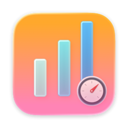

<div align="center">



# Claudit

**A lightweight macOS menu bar app that tracks your Claude API usage — cost, tokens, quota, and session analytics. Fully local.**

[](https://github.com/Bengerthelorf/Claudit/releases/latest)
&nbsp;
[](https://app.snaix.homes/claudit/)
&nbsp;
[](https://github.com/Bengerthelorf/Claudit#install)

</div>

---

## Highlights

- 💰 **Real-Time Cost** — Today's spend in the menu bar, updated automatically
- 📊 **Rich Dashboard** — Heatmaps, trend charts, model breakdowns, session browser, project analytics
- 🔔 **Quota Alerts** — System notification when your 5-hour window approaches the limit
- 🖥️ **Multi-Device** — Aggregate usage from remote machines over SSH
- 💬 **Session Reader** — Browse full conversations with search, highlighting, and tool call details
- 🔒 **Fully Local** — Parses `~/.claude` JSONL logs directly, no data leaves your machine
- ⚡ **Lightweight** — Native SwiftUI + AppKit with C-level I/O for large log files

## Install

### Homebrew

```bash
brew install Bengerthelorf/tap/claudit
```

### Manual

Download the latest DMG from [Releases](https://github.com/Bengerthelorf/Claudit/releases/latest), drag to Applications, and launch.

## Usage

Claudit runs in your menu bar, showing today's API cost at a glance. Click the icon to see:

- **Usage** — Today's cost, token breakdown by type, estimated daily burn rate
- **Quota** — 5-hour and 7-day utilization with countdown to reset

Open the **Dashboard** for deeper analytics across six tabs: Overview, Activity, Sessions, Projects, Models, and Tools.

### Remote Devices

Aggregate usage from other machines via SSH:

1. **Settings → Devices → Add Device**
2. Enter SSH host, test connection, save
3. Remote data appears alongside local data with fingerprint-based caching

> See [Remote Devices Guide](https://app.snaix.homes/claudit/guide/remote-devices) for details.

## System Requirements

- macOS 15.0 or later

## Development

```bash
git clone https://github.com/Bengerthelorf/Claudit.git
cd Claudit
open Claudit.xcodeproj
```

Release with:

```bash
./scripts/release.sh 0.0.5
```

## License

MIT License. See [LICENSE](LICENSE) for details.

---

<div align="center">

Made by [Bengerthelorf](https://github.com/Bengerthelorf)

</div>
